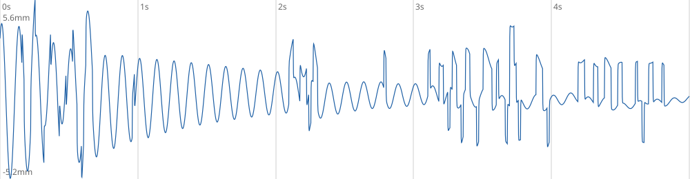
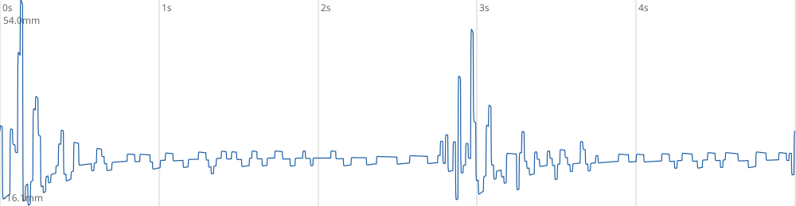
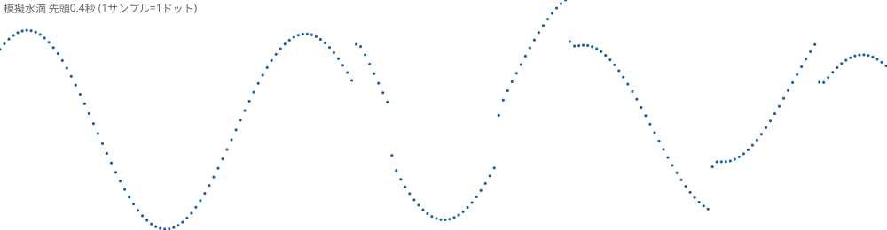
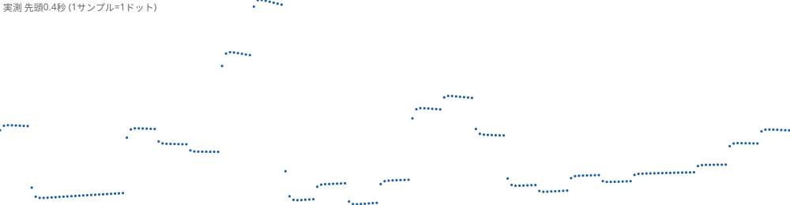

# M5StickS3_TOF

M5StickS3 で距離センサを動かし、水面の波紋（変位波形）をそのまま音声化する「波紋グレインシンセ」。
もともとは ToF Unit の速度検証テストとして開始し、現在は GP2Y0E03 を含む複数センサ対応の楽器ファームになっている。

**紹介ページ**: https://airpocket-soundman.github.io/M5StickS3_TOF/ — コンセプト（聞こえない波をピッチ変換で聴く）とシステム構成の解説

## 波紋→音声化の検証記録 (2026-08)

### 仕組み

```
センサ(〜300Hz) → メディアン3点 → 500Hz記録クロック → DC除去(0.5Hz HP) → ノイズ除去LP
→ 常時ローリング録音(15秒リング)
→ オンセット検出(ピークホールド包絡線 + 50msデバウンス + 減衰参照リトリガガード)
→ 着水起点5秒窓(2500サンプル)切り出し → 32倍時間圧縮 → 1回再生
→ 内蔵スピーカー + UDP→Tab5_synth(エフェクト/ADSR付き)
```

### 記録波形サンプル

模擬水滴（8Hz減衰サイン、シリアル`x`コマンドで注入）の5秒窓。パイプラインが波形を忠実に保存できていることの確認:



実測（手の動き）の5秒窓:



先頭0.4秒のドット表示（1サンプル=1ドット）。横に並ぶ点=センサ値の保持、段差=センサ更新。
保持2〜3サンプルのパターンから、センサ実更新レートが記録クロック(500Hz)より遅いことが読み取れる:




### GP2Y0E03 実効サンプルレートの実測結果

レジスタは公式最速設定（`0xA8=0x00`積算1回、`0x3F`中央値1、連続測定）を確認済み。
生レジスタ値の変化回数を直接カウントする方式で測定:

| 条件 | rawChangeHz |
| --- | --- |
| 静止ターゲット | 約200Hz（ノイズ<1LSBで同値が続くため下限値） |
| 高速手振り(800Hzポーリング) | **ピーク約340Hz、実用250〜300Hz** |

公式アプリケーションノート表16の測定時間「約1.9ms」(526Hz)に対し、実機は**約300Hz**で頭打ち。
レジスタ設定では超えられない実機限界と判断。波紋帯域（〜50Hz）には十分な時間分解能。

波形が階段状に見える原因は ①実更新〜300Hz vs 記録500Hzの保持 ②量子化0.156mm/LSB の2つ。
記録側LP(GP2Y0E03=60Hz)で平滑化して音声化している。

### シリアルコマンド（現行ファーム）

| コマンド | 意味 |
| --- | --- |
| `x` / `X` | 模擬水滴を注入（5mm / 15mm、8Hz減衰サイン） |
| `t+` / `t-` | オンセットしきい値 ±1.5倍 |
| `g+` / `g-` | 出力ゲイン ±1.5倍 |
| `p` | パラメータと統計を表示 |
| `w` | 最後に発音したグレイン波形をダンプ（2500点CSV） |

---

以下は初期のToF速度検証時のドキュメント。

M5StickS3 で M5Stack の ToF Unit を動かし、どれだけ高速に距離を取得できるかを確認するテスト。

## 目的

- Port.A の Grove 接続で ToF Unit を使う
- 実効サンプルレートを測る
- 10 サンプル単位でまとめてシリアルへ出す
- ディスプレイに履歴グラフを出す

## 想定ハード

- M5StickS3
- M5Stack ToF Unit
  - VL53L0X
  - I2C address `0x29`
  - Port.A 接続

## 配線

Port.A の Grove ケーブルをそのまま接続する。

M5StickS3 の Port.A は固定で:

- `SDA = G9`
- `SCL = G10`

このリポジトリのコードもこの固定配線前提で動く。

## ファイル

- `platformio.ini`
  - PlatformIO 設定
  - `M5Unified` と `VL53L0X` ライブラリを使用
- `src/main.cpp`
  - ToF の連続測距
  - バッチシリアル出力
  - ディスプレイグラフ描画

## ビルド

```powershell
pio run
```

書き込み:

```powershell
pio run -t upload
```

シリアルモニタ:

```powershell
pio device monitor
```

## 実装方針

VL53L0X は連続測距モードで動かす。
測距の速さは主に measurement timing budget に依存するので、コマンドで切り替えられるようにしている。

初期値:
- `20000 us`

切り替え候補:
- `20000 us`
- `33000 us`
- `50000 us`
- `100000 us`

## シリアル出力

### 定期ステータス

約 500ms ごとに出す。

例:

```text
tof=ready port="SDA=9 SCL=10" dist=154 valid=yes timeout=no budgetUs=20000 loopHz=1200.0 sampleHz=48.0 loopUs=820
```

意味:
- `tof`: センサ検出状態
- `port`: 実際に使っている SDA/SCL の組
- `dist`: 最新距離[mm]
- `valid`: 有効サンプルか
- `timeout`: タイムアウトしたか
- `budgetUs`: measurement timing budget
- `loopHz`: MCU の loop 回転数
- `sampleHz`: 実効サンプルレート
- `loopUs`: 直近 loop の処理時間

### バッチ出力

10 サンプルたまるごとに 1 行で出す。

例:

```text
batch budgetUs=20000 count=10 samples=1020:154:Y:-|1041:155:Y:-|...
```

各サンプルの形式:

```text
timestampMs:distanceMm:valid:timeout
```

意味:
- `timestampMs`: 取得時刻[ms]
- `distanceMm`: 距離[mm]
- `valid`: `Y` or `N`
- `timeout`: `T` なら timeout

## ディスプレイ

M5StickS3 の画面には次を出す。

- センサ状態
- 現在距離
- timing budget
- 直近 120 サンプルの距離グラフ

表示更新は 1 サンプルごとではなく、10 サンプルごとにまとめて行う。
これで描画負荷を抑えながら履歴を追える。

色:
- 緑: 距離グラフ
- 赤: timeout が出た時刻

## ボタンとスピーカ

- `BtnA` を押している間だけ、内蔵スピーカから C 音を鳴らす
- ボタンを離すと停止する

## シリアルコマンド

| コマンド | 意味 |
| --- | --- |
| `h` または `?` | ヘルプ表示 |
| `1` | timing budget を `20000 us` にする |
| `2` | timing budget を `33000 us` にする |
| `5` | timing budget を `50000 us` にする |
| `0` | timing budget を `100000 us` にする |
| `l` | バッチシリアル出力 on/off |
| `d` | ディスプレイ描画 on/off |
| `p` | Port.A を再 probe |
| `r` | 最新 1 サンプルを CSV で表示 |

## 見るポイント

- `20000 us` でどこまで `sampleHz` が出るか
- budget を上げた時に安定性がどう変わるか
- timeout が出る条件
- グラフ上でノイズや欠落がどう見えるか

## 高速サンプリング向け ToF 候補

今回の `VL53L0X` ベース ToF Unit は、measurement timing budget の都合で実効サンプルレートはおおむね `50Hz` 前後が上限目安になる。
より高速化を狙う場合の候補をここに残す。

### 候補比較表

高速 sampling、mm 単位の距離出力、到達距離 `500 mm` 程度の用途を基準に比較する。

| センサ | 種類 | 距離出力 | 短距離線形性 | 最大レンジ | 最大レート | 視野角 | 今回の適性 |
| --- | --- | --- | --- | --- | --- | --- | --- |
| `TOF050C / VL6180X` | 単点 ToF | `1 mm`（標準時） | 近距離向け | ST保証は `100 mm`、拡張で数百 mm 級 | 連続時は設定依存、実用は `10-100 Hz` 帯 | 狭い | 今回はレンジ不足 |
| `TOF200C / VL53L0X` | 単点 ToF | mm | 近距離は普通 | `2000 mm` 級 | 実用上 `50 Hz` 前後 | 狭い | 現行評価対象、速度面では弱い |
| `TOF400C / VL53L1X` | 単点 ToF | mm | 良い | `4000 mm` 級 | 実用上 `50 Hz` 前後 | 狭い | 長距離寄り、今回用途では次点 |
| `VL53L4CD` | 単点 ToF | mm | `1 mm down to` | `1200 mm` | `100 Hz` | `18°` | 最有力 |
| `VL53L4CX` | 単点 ToF | mm | `10 mm down to` | `6 m` | 高速だが L4CD より用途は長距離寄り | `18°` | 良い |
| `VL53L7CX` | `8x8 / 4x4` multizone | 各ゾーン mm | L4CD ほど近距離線形性を強く訴求していない | `350 cm` | `60 Hz` | `60° x 60°` | 単点高速用途には過剰 |
| `VL53L8CX` | `8x8 / 4x4` multizone | 各ゾーン mm | L4CD ほど近距離線形性を強く訴求していない | `400 cm` | `60 Hz` | `65° diagonal` | 単点高速用途には過剰 |

今回の用途では:
- `VL53L4CD` が最も適している
- `VL53L4CX` は悪くないが 500 mm 用途にはやや長距離寄り
- `TOF400C / VL53L1X` は M5Stack 系として扱いやすいが、高速化の伸びは限定的
- `TOF200C / VL53L0X` は現行評価対象で、速度面では一段不利
- `TOF050C / VL6180X` は超短距離向けで、500 mm 用途には合わない
- `VL53L7CX / VL53L8CX` は多点距離取得用途向け

### VL6180X の補足

`VL6180X` は今回追加した候補の中ではかなり性格が違う。

- ST 公式の保証レンジは `0 to 100 mm`
- 出力は `8-bit distance reading`
- 標準設定では `1 mm` 単位で扱える
- Pololu の解説では、レンジスケーリングで
  - `2x` にすると `2 mm` 分解能で `40 cm` 級
  - `3x` にすると `3 mm` 分解能で `60 cm` 級
  まで拡張可能
- 評価キット資料では continuous mode の inter-measurement period は `10 ms` から設定可能
- 一方で max convergence time のデフォルトは `30 ms`

つまり:
- 超短距離では扱いやすい
- しかし 500 mm を狙うと分解能を犠牲にする必要がある
- 今回の「500 mm 程度で高速 sampling + mm 分解能」には合わない

参照:
- ST VL6180X datasheet: <https://www.st.com/en/datasheet/vl6180x.pdf>
- Pololu VL6180X carrier notes: <https://www.pololu.com/product-info-merged/2489>

### 1. M5Stack Unit ToF4M

- センサ: `VL53L1X`
- 長距離化しやすく、M5Stack Unit として扱いやすい
- ただし timing budget の最小は実用上 `20ms` クラスなので、速度面は劇的には伸びにくい
- M5Stack 互換性を重視する場合の第一候補

リンク:
- M5Stack docs: <https://docs.m5stack.com/en/unit/Unit-ToF4M>
- ST VL53L1X datasheet: <https://www.st.com/resource/en/datasheet/vl53l1x.pdf>

### 2. VL53L4CD 系モジュール

- センサ: `VL53L4CD`
- ST 公式で `up to 100Hz`
- 近距離で高い更新レートを狙う用途に向く
- レンジは `0 to 1200mm`
- 「高速に 1 点距離を取りたい」用途ではかなり有力

リンク:
- ST product page: <https://www.st.com/en/imaging-and-photonics-solutions/vl53l4cd.html>

### 3. VL53L5CX 系モジュール

- センサ: `VL53L5CX`
- ST 公式で `up to 60Hz`
- 単点ではなく `4x4 / 8x8` のマルチゾーン距離取得
- 1 点だけの高速計測にはやや過剰だが、面の情報を取りたい場合に有効

リンク:
- ST product page: <https://www.st.com/en/imaging-and-photonics-solutions/vl53l5cx.html>

### 4. Benewake TF-Luna

- 小型 LiDAR 系距離センサ
- 公式マニュアルで `最高 250Hz`
- UART / I2C 対応
- M5Stack Unit ではないが、速度最優先ならかなり有力

リンク:
- Benewake official page: <https://en.benewake.com/TF-Luna/index.html>
- Benewake manual PDF: <https://en.benewake.com/uploadfiles/2025/04/20250430174515390.pdf>

## 候補の選び方

- M5Stack Unit のまま移行しやすくしたい: `Unit ToF4M`
- 1m 前後で高速サンプリングしたい: `VL53L4CD`
- 面で距離を見たい: `VL53L5CX`
- とにかく高速レート優先: `TF-Luna`
